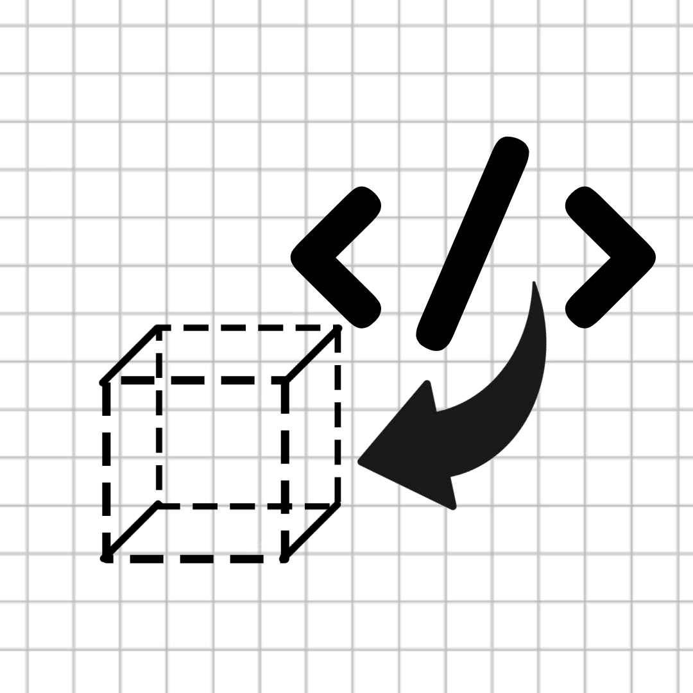

<!-- Improved compatibility of back to top link -->
<a id="readme-top"></a>

<!-- PROJECT SHIELDS -->
[![Contributors][contributors-shield]][contributors-url]
[![Forks][forks-shield]][forks-url]
[![Stargazers][stars-shield]][stars-url]
[![Issues][issues-shield]][issues-url]
[![MIT License][license-shield]][license-url]


<!-- PROJECT LOGO -->
<br />
<div align="center">
  <a href="https://github.com/Lokonco/ShellHacks2025">
    
  </a>

  <h3 align="center">PyCAD</h3>

  <p align="center">
    Create 3D Print-ready files using Python scripts
    <br />
    <a href="https://github.com/Lokonco/ShellHacks2025"><strong>Explore the docs »</strong></a>
    <br />
    <br />
    <a href="https://github.com/Lokonco/ShellHacks2025">View Demo</a>
    ·
    <a href="https://github.com/Lokonco/ShellHacks2025/issues/new?labels=bug&template=bug-report---.md">Report Bug</a>
    ·
    <a href="https://github.com/Lokonco/ShellHacks2025/issues/new?labels=enhancement&template=feature-request---.md">Request Feature</a>
  </p>
</div>


<!-- TABLE OF CONTENTS -->
<details>
  <summary>Table of Contents</summary>
  <ol>
    <li><a href="#about-the-project">About The Project</a></li>
    <li><a href="#built-with">Built With</a></li>
    <li><a href="#getting-started">Getting Started</a></li>
    <li><a href="#usage">Usage</a></li>
    <li><a href="#roadmap">Roadmap</a></li>
    <li><a href="#contributing">Contributing</a></li>
    <li><a href="#license">License</a></li>
    <li><a href="#contact">Contact</a></li>
    <li><a href="#acknowledgments">Acknowledgments</a></li>
  </ol>
</details>


<!-- ABOUT THE PROJECT -->
## About The Project

[![Product Screenshot][product-screenshot]](https://github.com/Lokonco/ShellHacks2025)

This project was built during **ShellHacks 2025**. The goal was to make an app that generates 3D-printable object files from Python scripts. This allows makers and hackers to brainstorm 3D print ideas quickly without needing advanced CAD software skills.

<p align="right">(<a href="#readme-top">back to top</a>)</p>


### Built With

* [![Vue][Vue.js]][Vue-url]
* [![Node][Node.js]][Node-url]
* [![Electron][Electron.com]][Electron-url]

<p align="right">(<a href="#readme-top">back to top</a>)</p>


<!-- GETTING STARTED -->
## Getting Started

Follow these steps to set up a local copy of **PyCAD**:

### Prerequisites

You’ll need [Node.js](https://nodejs.org/) and npm installed.
```sh
npm install npm@latest -g
